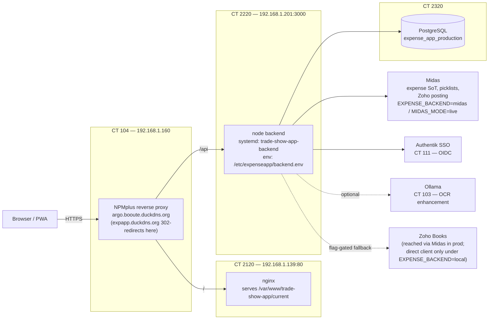
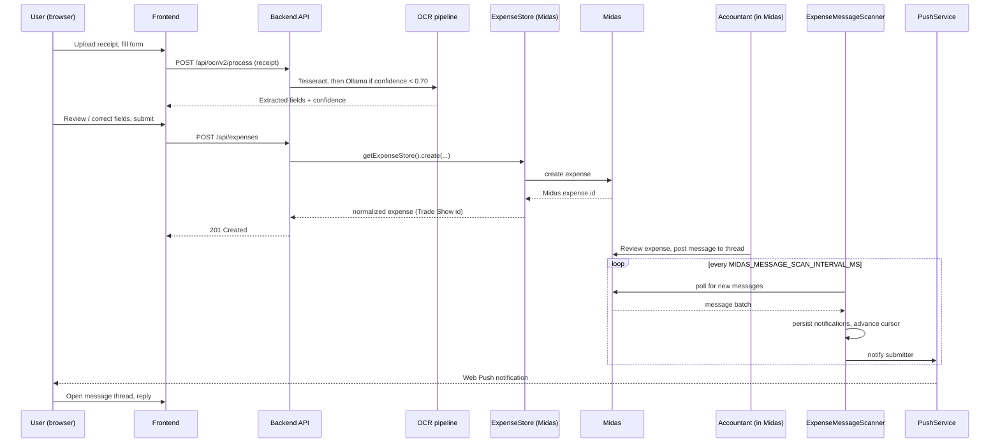
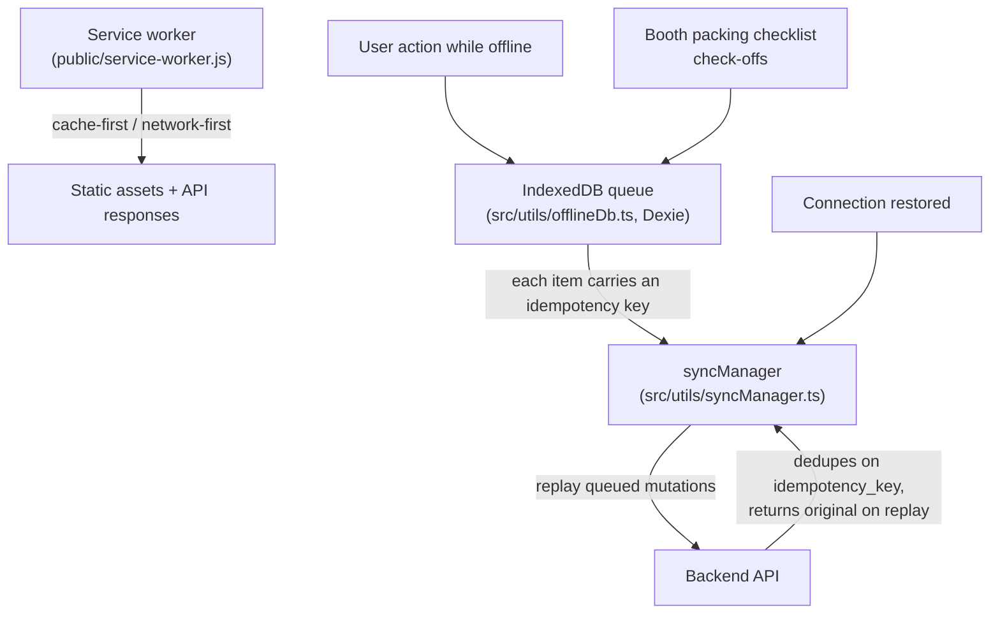
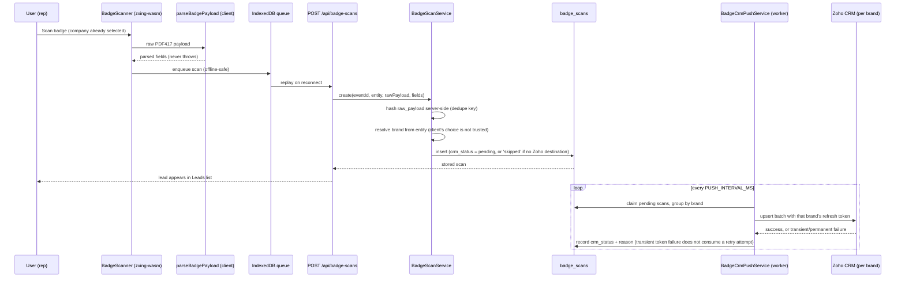

# Argo — Architecture

**Last verified:** 2026-09-16

## 1. Overview

Argo is a trade show expense management PWA: OCR receipt capture, event and booth-inventory logistics, automated expense approval, and an offline-first frontend backed by a background sync queue. The backend is Express/TypeScript over PostgreSQL (raw SQL, repository pattern, no ORM); the frontend is React/Vite. In production, expense data and Zoho Books posting are owned by an external system called Midas — Argo's own local expense store and Zoho client remain as a flag-gated fallback. Users authenticate via Authentik SSO (OIDC) or local password login.

## 2. Production topology

Sandbox is a single all-in-one container, CT 2600, running the same stack (frontend, backend, and PostgreSQL together) rather than the split topology above.

## 3. Backend architecture

Requests flow **routes → services → repositories → raw `pg` queries**. Route handlers stay thin; business logic and authorization live in services; data access is isolated behind the repository layer (`backend/src/database/repositories/`).

Key service boundaries (`backend/src/services/`):

- **`zohoIntegrationClient.ts`** — all Zoho Books OAuth and sync logic lives here; it is the only module that talks to Zoho directly.
- **`ocr/`** — Tesseract.js OCR → optional Ollama LLM enhancement (triggered when confidence < 0.70) → correction tracking (`UserCorrectionService.ts`).
- **`ExpenseService.ts`** — owns expense status transitions via 3-rule automated approval logic (regression detection back to "needs further review", auto-approve on entity assignment or reimbursement decision, no-op otherwise).
- **`EventParticipantService.ts`** — event-user relationship management.
- **`services/midas/`** (`MidasClient.ts`, `MockMidasClient.ts`, `statusMaps.ts`, `paymentMethodMap.ts`) — typed client for the external Midas API, plus the `EXPENSE_BACKEND` / `MIDAS_MODE` / `PICKLIST_SOURCE` env resolution used across the rest of the backend.
- **`services/expenseStore/`** — `ExpenseStore` is the interface that lets the rest of the backend read/write expenses without knowing which system of record is active; `LocalExpenseStore` and `MidasExpenseStore` implement it, `DualExpenseStore` fans out to both during migration, and `getExpenseStore()` picks one per `EXPENSE_BACKEND`. The local `expenses` table is frozen (no longer written) once a deployment cuts over to Midas.
- **`services/picklists/PicklistService.ts`** — resolves category/card/entity picklists; `PICKLIST_SOURCE` (`auto` | `midas` | `settings`) decides the source, where `auto` means "Midas iff `EXPENSE_BACKEND=midas`".
- **`ExpenseMessageScanner.ts`** — a pull-based poller, because Midas has no outbound webhook infrastructure. It polls for new expense messages and turns them into in-app notifications; delivery is at-least-once, collapsed to effectively-once by a unique constraint on the Midas message id.
- **`AuthentikOidcService.ts`** — OIDC login against Authentik; env-gated (dormant unless all four `AUTHENTIK_*`/`OIDC_REDIRECT_URI` vars are set), which doubles as the rollback switch.
- **`services/booth/`** (`BoothInventoryService.ts`, `BoothManifestService.ts`, `BoothMovementService.ts`, `BoothPackingService.ts`) — booth catalog, storage/manifest tracking, and the packing checklist, including idempotent replay of movement events keyed by a derived idempotency key.
- **`PushService.ts`** — Web Push notifications (VAPID); reports disabled and no-ops silently when VAPID keys are absent, so push is optional infrastructure everywhere it's called.
- **`services/badge/`** (`BadgeScanService.ts`, `BadgeCrmPushService.ts`, `badgeCrmConfig.ts`, `badgeCrmFields.ts`, `BadgeExportService.ts`) — PDF417 badge-scan validation, server-side brand resolution, and the per-brand Zoho CRM push worker; see §8.

### Expense submission under Midas

## 4. Frontend architecture

`src/App.tsx` is a single-page app that renders by role, not by route: `currentPage` is plain `useState`, not React Router, and each page section is gated by `user.role` checks in JSX (e.g. `events`/`checklist`/`booths` are hidden for `accountant`). Data-access hooks are colocated with the features that use them (e.g. `src/components/expenses/ExpenseSubmission/hooks/`, `src/components/reports/hooks/`), with `src/hooks/useAuth.ts` as the shared authentication/session hook used app-wide and `src/hooks/useExpenseMessages.ts` for the message-thread bell. All API calls go through `src/utils/apiClient.ts`, an Axios instance whose request interceptor injects the JWT `Authorization` header. Feature components live in folders under `src/components/`: `admin/`, `auth/`, `checklist/`, `expenses/`, `events/`, `reports/`, `developer/`, `booths/` (booth inventory and packing), and others.

## 5. Offline-first

The service worker caches static assets and uses a network-first strategy for API calls. Offline writes are queued in IndexedDB via Dexie (`src/utils/offlineDb.ts`); each queued mutation carries an idempotency key. `syncManager` replays the queue automatically on reconnect. Booth movement events and packing checklist check-offs are append-only and keyed so a replayed sync is safe — the backend dedupes on the idempotency key and returns the original result rather than erroring.

## 6. AuthN/AuthZ

Two login paths: local password auth (JWT, stored in `localStorage`, injected by the `apiClient` interceptor) and Authentik SSO via OIDC (`AuthentikOidcService.ts`), which is off by default and enabled only when its env vars are set. The `sessionTracker` middleware (`backend/src/middleware/sessionTracker.ts`) updates `last_activity` on authenticated requests, throttled for coarse freshness. Roles are database-driven (`roles` table, migration `003_create_roles_table.sql`): the system roles are `admin`, `accountant`, `coordinator`, `salesperson`, `developer`, `temporary`, `pending`, and custom roles can be created from the Admin UI. `developer` is the only role with access to `/dev-dashboard`.

## 7. Environments & config

| Environment | Topology | Key vars |
|---|---|---|
| Local | `npm run start:all`, single PostgreSQL DB | `EXPENSE_BACKEND=local` (default), `MIDAS_MODE=disabled` (default) |
| Sandbox | CT 2600, all-in-one (frontend + backend + PostgreSQL) | `EXPENSE_BACKEND`, `MIDAS_MODE`, `PICKLIST_SOURCE` set per current sandbox test scenario |
| Production | CT 2120 (frontend) / CT 2220 (backend) / CT 2320 (PostgreSQL), fronted by NPMplus on CT 104 | `EXPENSE_BACKEND=midas`, `MIDAS_MODE=live`, `PICKLIST_SOURCE=auto` (default; resolves to Midas), `AUTHENTIK_ISSUER`/`AUTHENTIK_CLIENT_ID`/`AUTHENTIK_CLIENT_SECRET`/`OIDC_REDIRECT_URI` (OIDC login), `ZOHO_*` (present only as the disabled fallback path) |

The authoritative env file in every deployed container is `/etc/expenseapp/backend.env` — not the repo's `backend/.env` or `env.example`, which are templates only.

Migrations auto-run at startup (`backend/src/database/migrate.ts`). A Postgres `42501` (insufficient privilege) error during a migration is caught and skipped rather than failing startup, so a deploy can silently ship without a migration actually applying. After any deploy that ships a new migration, verify it landed by checking the `schema_migrations` table on the target database rather than trusting a clean startup log.

## 8. Badge scanning

Leads are captured by scanning a trade-show attendee's PDF417 badge in a live camera viewfinder (`src/components/leads/BadgeScanner.tsx`). Decoding runs entirely on-device via zxing-wasm — no per-scan vendor fee, no server round-trip, and it works offline. The raw barcode payload is handed to a client-side parser (`src/utils/badge/parseBadgePayload.ts`) that classifies each token by what it looks like (email shape, ZIP shape, name-like, etc.) rather than by position, because badge formats vary by show vendor. The parser never throws: a token it cannot classify is simply left unmapped, and the raw payload is always retained so a future parser version can re-derive fields from a scan without re-scanning the badge.

Every scan is attributed to the company the rep represents at the moment of scanning; `BadgeScanService` resolves that company to a `brand` server-side — the client never chooses which Zoho CRM org receives a lead. A company with no Zoho destination (`zohoEnabled: false`) still yields a captured, exportable lead, stored with `crm_status = 'skipped'` rather than rejected. Scans dedupe on `(event_id, entity, payload_hash)`: the same badge scanned again for the same company at the same event is a no-op, but two brands sharing a booth can each legitimately capture the same attendee as two separate leads.

`BadgeCrmPushService` runs as a background worker (not on the request path — scanning never blocks on Zoho) that claims eligible rows, groups them per brand, and upserts each batch into that brand's Zoho CRM Tradeshows module using that brand's own refresh token, retrying transient failures with backoff. CRM field API names are discovered per brand and cached (`badgeCrmFields.ts`) rather than hardcoded, since the Tradeshows module is a custom module whose field names vary by org. Pushed records are later pulled back into `crm_leads` by the existing nightly `ZohoCrmLeadsService` sync, so a scanned lead flows through the same revenue-attribution pipeline (`LeadConversionService`) as any other lead.

Routes live at `/api/badge-scans` (list, create, get, patch, retry-push, export); export (`BadgeExportService`) produces CSV or XLSX with every captured field plus CRM status, so a show's leads are usable even when no CRM push ever succeeds. New table: `badge_scans` (migration `041_create_badge_scans.sql`), `raw_payload` never discarded.
